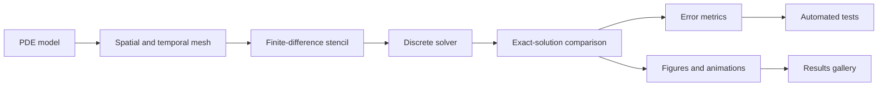
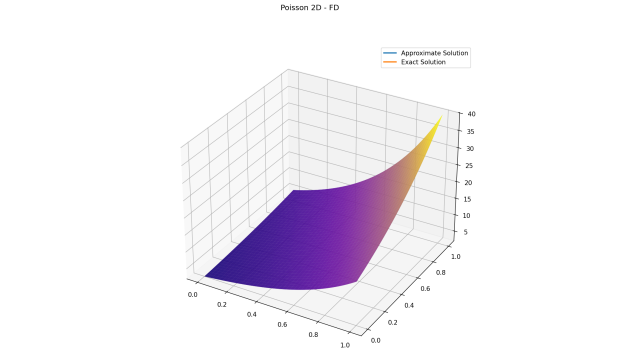
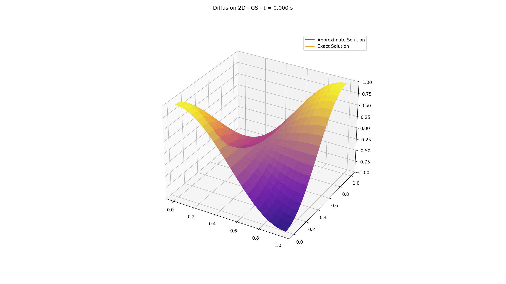
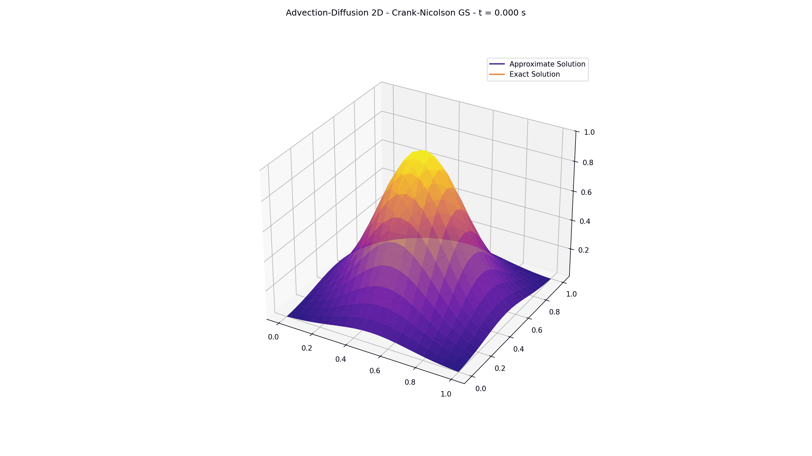
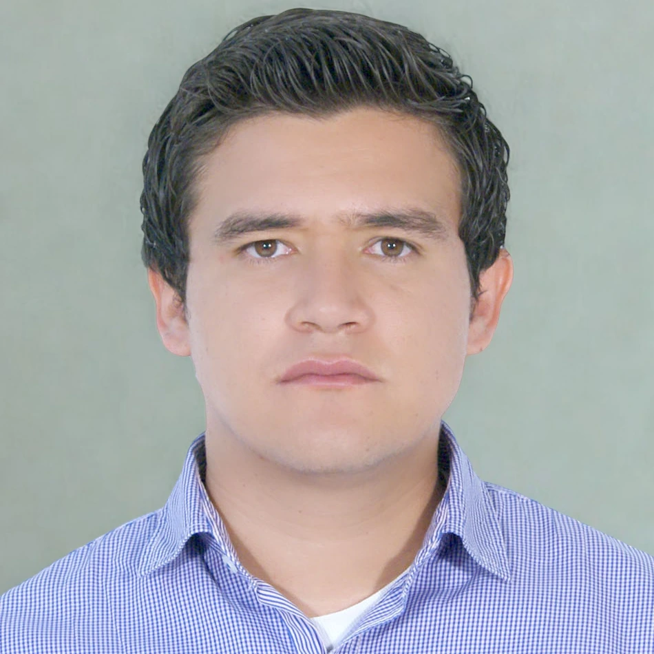
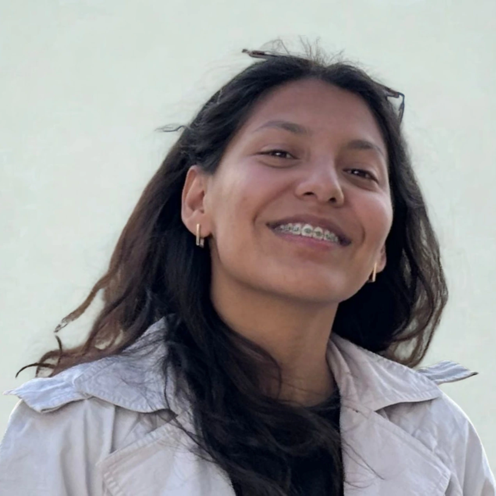

# Classical Finite Differences

<div align="center">

[](https://github.com/gstinoco/Classical_Finite_Differences)
[](https://www.python.org/downloads/)
[](https://numpy.org/)
[](https://matplotlib.org/)
[](https://docs.pytest.org/)
[](LICENSE)
[](CITATION.cff)

**A teaching-oriented Python laboratory for solving partial differential equations with classical finite differences.**

This repository connects the mathematical derivation of finite-difference schemes with readable implementations, reproducible examples, error metrics, automated tests, and visual results.

<br>

<table align="center">
  <tr>
    <td align="center"><a href="#quick-start"><b>:rocket: Quick Start</b></a><br><sub>Install and run a first example.</sub></td>
    <td align="center"><a href="#numerical-roadmap"><b>:compass: Roadmap</b></a><br><sub>How the project is organized.</sub></td>
    <td align="center"><a href="#equations-and-methods"><b>:triangular_ruler: Methods</b></a><br><sub>PDEs, schemes, and conventions.</sub></td>
    <td align="center"><a href="#results-gallery"><b>:movie_camera: Results</b></a><br><sub>Figures and animations.</sub></td>
  </tr>
  <tr>
    <td align="center"><a href="#error-metrics"><b>:bar_chart: Metrics</b></a><br><sub>How accuracy is measured.</sub></td>
    <td align="center"><a href="#automated-tests"><b>:test_tube: Tests</b></a><br><sub>Numerical verification.</sub></td>
    <td align="center"><a href="#teaching-use"><b>:mortar_board: Teaching</b></a><br><sub>Classroom and study uses.</sub></td>
    <td align="center"><a href="#team"><b>:scientist: Team</b></a><br><sub>People and support.</sub></td>
  </tr>
</table>

</div>

---

## :bulb: Why This Repository Exists

Finite differences are often the first place where students see partial differential equations become algorithms. The idea is simple:

```text
derivatives  ->  differences between neighboring grid values
PDE model    ->  algebraic equations on a mesh
solution     ->  arrays that can be measured, plotted, and tested
```

The purpose of this project is not to hide that process behind a black box. The purpose is to make each step visible:

| Step | What students can inspect |
|---|---|
| Mathematical model | The PDE, boundary conditions, and exact benchmark solution. |
| Discretization | The finite-difference stencil used in space and time. |
| Implementation | Matrix/vector formulations and node-wise stencil formulations. |
| Verification | Error metrics against exact solutions. |
| Visualization | Static plots and transient animations. |
| Testing | Automated checks that guard against regressions and unstable mistakes. |

The code is intentionally explicit. It is designed for lectures, guided labs, reports, and independent study.

## :compass: Numerical Roadmap

Each example follows the same computational story:



The repository currently includes five equation families:

<table>
  <thead>
    <tr>
      <th align="left">Equation</th>
      <th align="left">Main phenomenon</th>
      <th align="left">Example file</th>
    </tr>
  </thead>
  <tbody>
    <tr>
      <td><b>Poisson</b></td>
      <td>Steady potentials and elliptic boundary-value problems.</td>
      <td><code>Examples/CFDM_Poisson_examples.py</code></td>
    </tr>
    <tr>
      <td><b>Diffusion</b></td>
      <td>Smoothing, heat conduction, and gradient-driven transport.</td>
      <td><code>Examples/CFDM_Diffusion_examples.py</code></td>
    </tr>
    <tr>
      <td><b>Wave</b></td>
      <td>Oscillatory propagation and second-order time dynamics.</td>
      <td><code>Examples/CFDM_Wave_examples.py</code></td>
    </tr>
    <tr>
      <td><b>Advection</b></td>
      <td>Transport by a prescribed velocity field.</td>
      <td><code>Examples/CFDM_Advection_examples.py</code></td>
    </tr>
    <tr>
      <td><b>Advection-Diffusion</b></td>
      <td>Transport combined with smoothing.</td>
      <td><code>Examples/CFDM_Advection_Diffusion_examples.py</code></td>
    </tr>
  </tbody>
</table>

## :label: Method Labels

All methods in this repository are finite-difference methods. The labels used in the examples describe how the discrete equations are solved or organized.

### :pushpin: Stationary Poisson Problems

For Poisson, the examples use the traditional labels:

| Label | Meaning | Computational idea |
|---|---|---|
| `FD` | Finite-difference matrix formulation | Assemble the linear system and solve it directly. |
| `GS` | Gauss-Seidel formulation | Sweep through the grid using Gauss-Seidel updates. |

### :hourglass_flowing_sand: Transient Problems

For Diffusion, Wave, Advection, and Advection-Diffusion, the examples use implementation labels:

| Label | Meaning | Computational idea |
|---|---|---|
| `Matrix` | Matrix/vector formulation | Apply the stencil through an operator matrix or vectorized update. |
| `Stencil` | Node-wise stencil formulation | Evaluate the same stencil directly by sweeping over nodes. |

This distinction is important. In transient examples, both formulations are finite-difference implementations; the time-integration scheme is stated separately, for example `Explicit`, `Crank-Nicolson`, or the centered wave update.

## :open_file_folder: Repository Structure

```text
Classical Finite Differences/
├── CFDM/
│   ├── Poisson.py
│   ├── Diffusion.py
│   ├── Wave.py
│   ├── Advection.py
│   └── Advection_Diffusion.py
├── Common/
│   ├── Metrics.py
│   ├── Graphs.py
│   ├── ExampleTools.py
│   └── TimeIntegrators/
├── Examples/
│   ├── CFDM_Poisson_examples.py
│   ├── CFDM_Diffusion_examples.py
│   ├── CFDM_Wave_examples.py
│   ├── CFDM_Advection_examples.py
│   └── CFDM_Advection_Diffusion_examples.py
├── Results/
├── Tests/
├── assets/
├── requirements.txt
├── CITATION.cff
├── LICENSE
└── README.md
```

| Directory | Purpose |
|---|---|
| `CFDM/` | Numerical solvers for each PDE family. |
| `Common/` | Shared tools for metrics, plotting, output formatting, and auxiliary time integrators. |
| `Examples/` | Complete executable workflows for each equation. |
| `Results/` | Versionable figures and animations generated by the examples. |
| `Tests/` | Automated tests for accuracy, consistency, rectangular grids, warnings, and implementation agreement. |
| `assets/` | Images used by the README and teaching presentation. |

## :rocket: Quick Start

### :one: Clone

```bash
git clone https://github.com/gstinoco/Classical_Finite_Differences.git
cd Classical_Finite_Differences
```

### :two: Install

A virtual environment or Conda environment is recommended.

```bash
pip install -r requirements.txt
```

Dependencies:

```text
numpy
matplotlib
opencv-python
pytest
```

### :three: Run a First Example

```bash
python Examples/CFDM_Poisson_examples.py
```

This prints error tables and writes figures under:

```text
Results/Poisson/
```

## :computer: Running the Examples

Each example file can be executed directly:

| Equation | Command |
|---|---|
| Poisson | `python Examples/CFDM_Poisson_examples.py` |
| Diffusion | `python Examples/CFDM_Diffusion_examples.py` |
| Wave | `python Examples/CFDM_Wave_examples.py` |
| Advection | `python Examples/CFDM_Advection_examples.py` |
| Advection-Diffusion | `python Examples/CFDM_Advection_Diffusion_examples.py` |

Examples can also be called from Python to control cost, suppress file output, or reuse arrays in a notebook:

```python
from Examples import CFDM_Diffusion_examples as diffusion_examples

diffusion_examples.main(
    show=False,
    save_path=None,
    nodes_1d=21,
    nodes_2d=21,
    time_steps=200,
)
```

Common parameters:

| Parameter | Meaning |
|---|---|
| `show` | Opens interactive plot windows when set to `True`. |
| `save_path` | Output directory; if `None`, figures are not saved. |
| `nodes_1d` | Number of spatial nodes for one-dimensional examples. |
| `nodes_2d` | Number of nodes per spatial direction for two-dimensional examples. |
| `time_steps` | Number of time levels for transient examples. |

## :movie_camera: Results Gallery

The `Results/` directory is part of the teaching material. It provides a visual reference for the methods and a reproducible gallery of outputs.

<table align="center">
  <thead>
    <tr>
      <th align="center">Stationary Example</th>
    </tr>
  </thead>
  <tbody>
    <tr>
      <td align="center">
        <a href="Results/Poisson/2D_FD.png">
          
        </a><br>
        <sub><code>Poisson/2D_FD.png</code></sub>
      </td>
    </tr>
  </tbody>
</table>

<table align="center">
  <thead>
    <tr>
      <th align="center">Diffusion</th>
      <th align="center">Wave</th>
    </tr>
  </thead>
  <tbody>
    <tr>
      <td align="center" width="50%">
        <a href="Results/Diffusion/2D_Stencil.gif">
          
        </a><br>
        <sub><code>Diffusion/2D_Stencil.gif</code></sub>
      </td>
      <td align="center" width="50%">
        <a href="Results/Wave/2D_Stencil.gif">
          
        </a><br>
        <sub><code>Wave/2D_Stencil.gif</code></sub>
      </td>
    </tr>
    <tr>
      <th align="center">Advection</th>
      <th align="center">Advection-Diffusion</th>
    </tr>
    <tr>
      <td align="center" width="50%">
        <a href="Results/Advection/2D_Matrix_LaxWendroff.gif">
          
        </a><br>
        <sub><code>Advection/1D_Matrix_LaxWendroff.gif</code></sub>
      </td>
      <td align="center" width="50%">
        <a href="Results/Advection_Diffusion/2D_Stencil_CN.gif">
          
        </a><br>
        <sub><code>Advection_Diffusion/2D_Stencil_CN.gif</code></sub>
      </td>
    </tr>
  </tbody>
</table>

Representative outputs:

| Family | Example output |
|---|---|
| Poisson | `Results/Poisson/2D_FD.png` |
| Diffusion | `Results/Diffusion/2D_Stencil.gif` |
| Wave | `Results/Wave/2D_Stencil.gif` |
| Advection | `Results/Advection/1D_Matrix_LaxWendroff.gif` |
| Advection-Diffusion | `Results/Advection_Diffusion/2D_Stencil_CN.gif` |

Naming convention:

```text
Results/<Equation>/<Dimension>_<Formulation>_<Method>.<ext>
```

Examples:

```text
1D_FD.png
1D_GS_Neumann_2.png
2D_Matrix_FTBS.gif
2D_Stencil_CN.gif
```

## :triangular_ruler: Equations and Methods

### :magnet: Poisson Equation

Poisson problems are stationary boundary-value problems that appear in electrostatics, gravitation, pressure projection, potential theory, and steady-state modeling.

Project convention:

```text
Delta phi = -f
```

Available solvers:

| Case | FD | GS |
|---|---|---|
| 1D Dirichlet Poisson | `Poisson1D` | `Poisson1D_iter` |
| 2D Dirichlet Poisson | `Poisson2D` | `Poisson2D_iter` |
| 1D Neumann variant 1 | `Poisson1D_Neumann_1` | `Poisson1D_Neumann_1_iter` |
| 1D Neumann variant 2 | `Poisson1D_Neumann_2` | `Poisson1D_Neumann_2_iter` |
| 1D Neumann variant 3 | `Poisson1D_Neumann_3` | `Poisson1D_Neumann_3_iter` |

The Neumann variants compare different finite-difference approximations for the derivative condition at the left boundary. The examples keep a Dirichlet condition at the right boundary.

### :droplet: Diffusion Equation

Diffusion models smoothing, heat conduction, concentration spreading, and gradient-driven transport.

Typical forms:

```text
u_t = nu u_xx
u_t = nu Delta u
```

Available solvers:

| Case | Matrix | Stencil |
|---|---|---|
| 1D diffusion | `Diffusion1D` | `Diffusion1D_iter` |
| 2D diffusion | `Diffusion2D` | `Diffusion2D_iter` |

The 2D solver can run with an explicit update or with a Crank-Nicolson-type option:

```python
implicit=True
lam=0.5
```

### :ocean: Wave Equation

The wave equation models propagation with finite speed, including vibrations, signals, and oscillatory fields.

Typical forms:

```text
u_tt = c^2 u_xx
u_tt = c^2 Delta u
```

Available solvers:

| Case | Matrix | Stencil |
|---|---|---|
| 1D wave equation | `Wave1D` | `Wave1D_iter` |
| 2D wave equation | `Wave2D` | `Wave2D_iter` |

The implemented scheme uses centered finite differences in time and space. The first two time levels are initialized from the exact benchmark solution used by the examples.

### :dash: Advection Equation

Advection describes transport by velocity: a profile moves through the domain while the numerical method attempts to preserve its shape.

Typical forms:

```text
u_t + a u_x = 0
u_t + a u_x + b u_y = 0
```

Available solvers:

| Case | Matrix | Stencil |
|---|---|---|
| 1D advection | `Advection1D` | `Advection1D_iter` |
| 2D advection | `Advection2D` | `Advection_2D_iter` |

Implemented schemes:

| Scheme | Teaching role |
|---|---|
| `FTCS` | Centered spatial difference; useful for discussion, but unstable for pure advection in standard settings. |
| `FTBS` | Upwind scheme for positive velocities. |
| `FTFS` | Upwind scheme for negative velocities. |
| `LaxWendroff` | Second-order method for smooth transport under appropriate CFL conditions. |

### :twisted_rightwards_arrows: Advection-Diffusion Equation

Advection-Diffusion combines transport by velocity with diffusion-driven smoothing.

Typical forms:

```text
u_t + a u_x = nu u_xx
u_t + a u_x + b u_y = nu Delta u
```

Available solvers:

| Case | Matrix | Stencil |
|---|---|---|
| 1D advection-diffusion | `AdvectionDiffusion1D` | `AdvectionDiffusion1D_iter` |
| 2D advection-diffusion | `AdvectionDiffusion2D` | `AdvectionDiffusion2D_iter` |

Example labels:

| Label | Meaning |
|---|---|
| `Explicit Matrix` | Explicit time stepping with matrix/vector finite-difference implementation. |
| `Explicit Stencil` | Explicit time stepping with node-wise stencil implementation. |
| `Crank-Nicolson Matrix` | Crank-Nicolson-type update with matrix/vector implementation. |
| `Crank-Nicolson Stencil` | Crank-Nicolson-type update with node-wise stencil implementation. |

## :vertical_traffic_light: Boundary Conditions and Stability

The examples impose boundary values from the exact solution whenever possible. This makes verification direct because the numerical solution can be compared point by point against a known reference.

| Topic | Convention |
|---|---|
| Dirichlet boundaries | Boundary values are assigned from the exact solution. |
| Neumann boundaries | Poisson 1D includes three derivative-stencil variants. |
| Positive advection velocity | The upwind direction corresponds to `FTBS`. |
| Negative advection velocity | The upwind direction corresponds to `FTFS`. |
| Transient examples | Parameters are chosen to keep the demonstrated cases within a stable working range. |

Some schemes are included because they are pedagogically useful even when they are not the best production choice. For example, unstable or conditionally stable methods are valuable for showing why discretization decisions matter.

## :bar_chart: Error Metrics

The examples print a common table of metrics so different methods can be compared using the same language.

Let `u_ex` be the exact solution and `u_ap` the numerical approximation.

| Metric | Formula | Interpretation |
|---|---|---|
| `MAE` | `mean(abs(u_ex - u_ap))` | Average absolute error, in the same units as the solution. |
| `MSE` | `mean((u_ex - u_ap)^2)` | Squared error average; penalizes large errors more strongly. |
| `RMSE` | `sqrt(MSE)` | Root mean squared error, again in solution units. |
| `MAPE` | `mean(abs((u_ex - u_ap)/u_ex))*100` | Percentage error; interpret carefully near exact zeros. |
| `R^2` | `1 - SS_res/SS_tot` | Agreement with the variation of the exact solution. |

For transient examples, the metrics are computed over the full space-time solution arrays, not only at the final time.

## :test_tube: Automated Tests

Run the full test suite with:

```bash
python -W error::RuntimeWarning -m pytest Tests
```

The warning policy is intentional. Runtime warnings such as overflow, invalid values, or division by zero often reveal unstable parameters, indexing mistakes, or boundary-condition errors.

You can also check syntax and import-time correctness with:

```bash
python -m compileall CFDM Common Examples Tests
```

Current tests cover:

| Test focus | Why it matters |
|---|---|
| Accuracy against exact solutions | Confirms that examples solve the intended benchmark problem. |
| Matrix vs stencil consistency | Checks that paired formulations agree numerically. |
| Rectangular meshes | Helps detect swapped axes and hidden square-grid assumptions. |
| CFL-aware transient cases | Guards against accidental unstable parameter choices. |
| Warning-free execution | Catches numerical failures before they become silent bad results. |

## :world_map: Suggested Learning Path

1. Start with `Examples/CFDM_Poisson_examples.py` to study stationary boundary-value problems.
2. Move to `Examples/CFDM_Diffusion_examples.py` to see how a solution evolves in time.
3. Explore `Examples/CFDM_Wave_examples.py` to compare oscillatory propagation with diffusive smoothing.
4. Continue with `Examples/CFDM_Advection_examples.py` to study transport, upwinding, and method choice.
5. Finish with `Examples/CFDM_Advection_Diffusion_examples.py` to combine transport and diffusion.
6. Open the corresponding files in `CFDM/` and compare `FD/GS` for Poisson with `Matrix/Stencil` for transient equations.
7. Inspect `Common/Metrics.py`, `Common/Graphs.py`, and `Common/ExampleTools.py` to see how verification and visualization are shared.
8. Modify a benchmark solution or mesh size, then run the tests again.

## :mortar_board: Teaching Use

This project can support lectures, laboratory sessions, workshops, homework discussions, and self-study.

<table>
  <thead>
    <tr>
      <th align="left" width="240">Teaching activity</th>
      <th align="left">How the repository helps</th>
    </tr>
  </thead>
  <tbody>
    <tr>
      <td><b>Derive a finite-difference scheme</b></td>
      <td>Students can compare the derived stencil with the implementation in <code>CFDM/</code>.</td>
    </tr>
    <tr>
      <td><b>Compare formulations</b></td>
      <td>Poisson shows <code>FD</code> versus <code>GS</code>; transient equations show <code>Matrix</code> versus <code>Stencil</code>.</td>
    </tr>
    <tr>
      <td><b>Discuss stability</b></td>
      <td>Changing mesh sizes or time steps reveals why numerical parameters matter.</td>
    </tr>
    <tr>
      <td><b>Practice verification</b></td>
      <td>Exact solutions, common metrics, and tests make numerical accuracy measurable.</td>
    </tr>
    <tr>
      <td><b>Build reports</b></td>
      <td>The generated figures and tables can be used directly as reproducible evidence.</td>
    </tr>
  </tbody>
</table>

## :wrench: Development Conventions

| Convention | Purpose |
|---|---|
| Public `.py` files start with a complete institutional header. | Preserve authorship, context, funding, and revision history. |
| Public functions include complete docstrings. | Make numerical assumptions, arguments, and return values explicit. |
| Inline comments describe meaningful operations. | Support line-by-line guided reading. |
| Python files include an `if __name__ == "__main__":` block when direct execution is meaningful. | Make scripts easy to run from the terminal. |
| Example outputs use `FD/GS` for Poisson and `Matrix/Stencil` for transient equations. | Keep tables, figures, and filenames mathematically accurate. |
| Local planning files use names such as `*.local.*`. | Keep private review notes out of version control. |

## :scientist: Team

<div align="center">

### :star2: Meet the Team
*Faculty and students building readable, reproducible teaching material for classical finite differences*

</div>

### :busts_in_silhouette: Main Contributors

<table align="center">
  <thead>
    <tr>
      <th align="center" width="120">Photo</th>
      <th align="left">Contributor</th>
      <th align="left">Affiliation</th>
      <th align="left">Contact</th>
    </tr>
  </thead>
  <tbody>
    <tr>
      <td align="center" width="120">
        
      </td>
      <td>
        <b>Dr. Gerardo Tinoco Guerrero</b> :mexico:<br/>
        <sub>Numerical Methods, Scientific Computing &amp; Teaching Material</sub>
      </td>
      <td>
        <a href="http://www.siiia.com.mx"></a><br/>
        <a href="http://www.umich.mx"></a>
      </td>
      <td>
        <a href="mailto:gerardo.tinoco@umich.mx"></a><br/>
        <a href="https://orcid.org/0000-0003-3119-770X"></a><br/>
        <a href="https://www.researchgate.net/profile/Gerardo-Tinoco-Guerrero"></a>
      </td>
    </tr>
    <tr>
      <td align="center" width="120">
        
      </td>
      <td>
        <b>Dr. Francisco Javier Domínguez Mota</b> :mexico:<br/>
        <sub>Applied Mathematics &amp; Finite Difference Methods</sub>
      </td>
      <td>
        <a href="http://www.siiia.com.mx"></a><br/>
        <a href="http://www.umich.mx"></a>
      </td>
      <td>
        <a href="mailto:francisco.mota@umich.mx"></a><br/>
        <a href="https://orcid.org/0000-0001-6837-172X"></a><br/>
        <a href="https://www.researchgate.net/profile/Francisco-Dominguez-Mota"></a>
      </td>
    </tr>
    <tr>
      <td align="center" width="120">
        
      </td>
      <td>
        <b>Dr. José Alberto Guzmán Torres</b> :mexico:<br/>
        <sub>Computational Engineering &amp; Educational Technology</sub>
      </td>
      <td>
        <a href="http://www.siiia.com.mx"></a><br/>
        <a href="http://www.umich.mx"></a>
      </td>
      <td>
        <a href="mailto:jose.alberto.guzman@umich.mx"></a><br/>
        <a href="https://orcid.org/0000-0002-9309-9390"></a><br/>
        <a href="https://www.researchgate.net/profile/Jose-Guzman-Torres"></a>
      </td>
    </tr>
    <tr>
      <td align="center" width="120">
        
      </td>
      <td>
        <b>Dr. Heriberto Árias Rojas</b> :mexico:<br/>
        <sub>Engineering Applications &amp; Numerical Modeling</sub>
      </td>
      <td>
        <a href="http://www.siiia.com.mx"></a><br/>
        <a href="http://www.umich.mx"></a>
      </td>
      <td>
        <a href="mailto:heriberto.arias@umich.mx"></a><br/>
        <a href="https://orcid.org/0000-0002-7641-8310"></a><br/>
        <a href="https://www.researchgate.net/profile/Heriberto-Arias-Rojas"></a>
      </td>
    </tr>
  </tbody>
</table>

### :mortar_board: Ph.D. Student Contributors

<table align="center">
  <thead>
    <tr>
      <th align="center" width="120">Photo</th>
      <th align="left">Student</th>
      <th align="left">Institution</th>
      <th align="left">Contact</th>
    </tr>
  </thead>
  <tbody>
    <tr>
      <td align="center" width="120">
        
      </td>
      <td>
        <b>Gabriela Pedraza-Jiménez</b><br/>
        
      </td>
      <td>
        <a href="http://www.umich.mx"></a>
      </td>
      <td>
        <a href="mailto:2220157h@umich.mx"></a>
      </td>
    </tr>
    <tr>
      <td align="center" width="120">
        
      </td>
      <td>
        <b>Eli Chagolla-Inzunza</b><br/>
        
      </td>
      <td>
        <a href="http://www.umich.mx"></a>
      </td>
      <td>
        <a href="mailto:1137626b@umich.mx"></a>
      </td>
    </tr>
  </tbody>
</table>

### :mortar_board: M.Sc. Student Contributors

<table align="center">
  <thead>
    <tr>
      <th align="center" width="120">Photo</th>
      <th align="left">Student</th>
      <th align="left">Institution</th>
      <th align="left">Contact</th>
    </tr>
  </thead>
  <tbody>
    <tr>
      <td align="center" width="120">
        
      </td>
      <td>
        <b>Jorge L. González-Figueroa</b><br/>
        
      </td>
      <td>
        <a href="http://www.umich.mx"></a>
      </td>
      <td>
        <a href="mailto:1718717h@umich.mx"></a>
      </td>
    </tr>
    <tr>
      <td align="center" width="120">
        
      </td>
      <td>
        <b>Christopher N. Magaña-Barocio</b><br/>
        
      </td>
      <td>
        <a href="http://www.umich.mx"></a>
      </td>
      <td>
        <a href="mailto:1339846k@umich.mx"></a>
      </td>
    </tr>
  </tbody>
</table>

### :mortar_board: Undergraduate Student Contributors

<table align="center">
  <thead>
    <tr>
      <th align="center" width="120">Photo</th>
      <th align="left">Student</th>
      <th align="left">Institution</th>
      <th align="left">Contact</th>
    </tr>
  </thead>
  <tbody>
    <tr>
      <td align="center" width="120">
        
      </td>
      <td>
        <b>Maria Goretti Fraga-Lopez</b><br/>
        
      </td>
      <td>
        <a href="http://www.umich.mx"></a>
      </td>
      <td>
        <a href="mailto:1702174b@umich.mx"></a>
      </td>
    </tr>
  </tbody>
</table>

---

## :factory: Institutional and Technical Support

<div align="center">

### :star2: Academic and Engineering Support
*Collaboration that helps keep the examples, documentation, and computational tools useful for teaching*

</div>

<div align="center">

<table align="center" width="70%">
<tr>
<td align="center">

### :factory: **SIIIA MATH**
#### *Soluciones de Ingeniería, México*

<div align="center">

[](http://www.siiia.com.mx)
[](http://www.siiia.com.mx)
[](http://www.siiia.com.mx)

</div>

**🎯 Support areas:**
- Mathematical modeling and simulation
- Scientific computing examples
- Educational software and documentation

<div align="center">

[](mailto:gtinoco@siiia.com.mx)

</div>

</td>
</tr>
</table>

</div>


## :memo: Citation

If this repository supports a course, workshop, thesis, report, publication, or derived implementation, please cite it as academic software. Citation metadata is provided in [`CITATION.cff`](CITATION.cff), which GitHub and other tools can use to generate additional formats.

The citation below lists the main software authors. The broader research team shown above may be acknowledged when their participation is relevant to a specific course, report, or derived project.

Recommended citation:

```text
Tinoco Guerrero, G., Domínguez Mota, F. J., Guzmán Torres, J. A., & Árias Rojas, H. (2026).
Classical Finite Differences [Software].
Universidad Michoacana de San Nicolás de Hidalgo and SIIIA MATH.
https://github.com/gstinoco/Classical_Finite_Differences
```

BibTeX:

```bibtex
@software{tinoco_guerrero_2026_classical_finite_differences,
  author       = {Tinoco Guerrero, Gerardo and Domínguez Mota, Francisco Javier and Guzmán Torres, José Alberto and Árias Rojas, Heriberto},
  title        = {Classical Finite Differences},
  year         = {2026},
  publisher    = {Universidad Michoacana de San Nicolás de Hidalgo and SIIIA MATH},
  type         = {Software},
  url          = {https://github.com/gstinoco/Classical_Finite_Differences},
  license      = {MIT}
}
```

## :scroll: License

This project is distributed under the MIT License. See [`LICENSE`](LICENSE) for the full license text.

---

<div align="center">

*Making classical finite differences easier to study, verify, and teach*

[](https://github.com/gstinoco/Classical_Finite_Differences/stargazers) [](https://github.com/gstinoco/Classical_Finite_Differences/network/members) [](https://github.com/gstinoco/Classical_Finite_Differences/watchers)

<br/>

<b>If this project helps your research, please consider giving it a star.</b>

</div>
