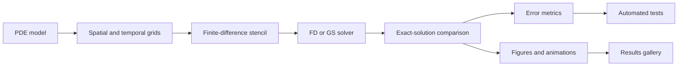
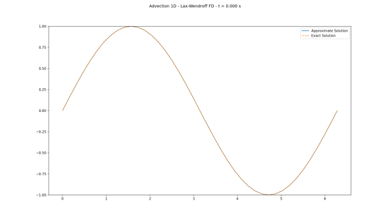

# Classical Finite Differences

<div align="center">

[](https://github.com/gstinoco/Classical-Finite-Differences)
[](https://www.python.org/downloads/)
[](https://numpy.org/)
[](https://matplotlib.org/)
[](https://docs.pytest.org/)
[](https://opensource.org/licenses/MIT)

**A computational and pedagogical guide to solving partial differential equations with classical finite differences.**

This repository brings together solvers, examples, error metrics, automated tests, and graphical results for studying fundamental models in applied mathematics, physics, and engineering.

### Quick Links

[](#quick-start)
[](#what-you-will-learn)
[](#running-the-examples)
[](#results-gallery)
[](#equations-and-methods-included)
[](#how-error-is-measured)
[](#author-institutions-and-funding)

</div>

---

## Contents

<table>
  <tr>
    <td width="33%"><a href="#welcome"><b>Welcome</b></a><br><sub>Purpose and teaching philosophy.</sub></td>
    <td width="33%"><a href="#what-you-will-learn"><b>What You Will Learn</b></a><br><sub>Concepts covered by the project.</sub></td>
    <td width="33%"><a href="#quick-start"><b>Quick Start</b></a><br><sub>Installation and first run.</sub></td>
  </tr>
  <tr>
    <td><a href="#running-the-examples"><b>Running the Examples</b></a><br><sub>How to execute each solver family.</sub></td>
    <td><a href="#results-gallery"><b>Results Gallery</b></a><br><sub>Figures and animations produced by the examples.</sub></td>
    <td><a href="#equations-and-methods-included"><b>Equations and Methods</b></a><br><sub>Implemented PDEs, schemes, and conventions.</sub></td>
  </tr>
  <tr>
    <td><a href="#how-error-is-measured"><b>Error Metrics</b></a><br><sub>MAE, MSE, RMSE, MAPE, and R^2.</sub></td>
    <td><a href="#automated-tests"><b>Automated Tests</b></a><br><sub>Verification commands and warning policy.</sub></td>
    <td><a href="#author-institutions-and-funding"><b>Author and Funding</b></a><br><sub>Academic profile and institutional support.</sub></td>
  </tr>
</table>

## Welcome

Finite differences are one of the clearest entry points into numerical methods for partial differential equations. The central idea is simple and powerful: replace derivatives with differences between neighboring values on a grid.

This project is designed so that students, instructors, and researchers can see that idea working from beginning to end:

- define a partial differential equation;
- choose a spatial grid and, when needed, a time grid;
- approximate derivatives with a finite-difference stencil;
- solve the discrete problem using a matrix-based or iterative formulation;
- compare the numerical solution against an exact solution;
- report error metrics and generate reproducible figures.

The goal is not to hide the mathematics behind a black-box interface. The goal is the opposite: each implementation is written to be read, followed, modified, and used as teaching material.

## At a Glance

<table>
  <thead>
    <tr>
      <th align="left" width="180">Area</th>
      <th align="left">What you can do</th>
      <th align="left" width="190">Where to start</th>
    </tr>
  </thead>
  <tbody>
    <tr>
      <td><b>Numerical solvers</b></td>
      <td>Study classical finite-difference implementations for Poisson, diffusion, advection, and advection-diffusion equations.</td>
      <td><code>CFDM/</code></td>
    </tr>
    <tr>
      <td><b>Guided examples</b></td>
      <td>Run complete workflows that build grids, call solvers, compute errors, and generate plots.</td>
      <td><code>Examples/</code></td>
    </tr>
    <tr>
      <td><b>Reusable tools</b></td>
      <td>Use shared utilities for metrics, tables, paths, figures, animations, and time integration helpers.</td>
      <td><code>Common/</code></td>
    </tr>
    <tr>
      <td><b>Verification</b></td>
      <td>Compare numerical results against exact solutions and protect the code with automated tests.</td>
      <td><code>Tests/</code></td>
    </tr>
  </tbody>
</table>

## Numerical Workflow

The examples follow the same numerical story across all equation families. This makes the project easier to teach, compare, and extend.



## What You Will Learn

This repository can be read as a compact laboratory for numerical methods. By working through the code and examples, you can study:

| Topic | What the project shows |
|---|---|
| Spatial discretization | How derivatives are approximated with centered, backward, and forward stencils. |
| Time discretization | How transient solutions are advanced in time. |
| Matrix formulation | How a finite-difference scheme can be written as a matrix system or vectorized update. |
| Iterative formulation | How the same stencil can be implemented by sweeping over grid nodes. |
| Boundary conditions | How Dirichlet and Neumann-type boundary conditions are imposed. |
| Stability | Why CFL-type restrictions appear in transient problems. |
| Verification | How numerical approximations are compared against exact solutions. |
| Visualization | How numerical arrays become figures and animations. |

## The Core Idea: FD and GS

The examples use two method labels consistently:

| Label | Meaning | Practical idea |
|---|---|---|
| `FD` | Finite Differences, matrix/direct formulation | Build a discrete operator and apply it as a matrix, linear system, or vectorized update. |
| `GS` | Gauss-Seidel, iterative formulation | Sweep through the grid and update nodes with the corresponding stencil. |

Both formulations are finite-difference methods. The distinction is how the computation is organized.

This comparison is useful in a classroom setting because it makes two questions visible:

1. Does the matrix implementation match the stencil implemented with loops?
2. What changes in clarity, cost, and numerical control when the same scheme is written in different computational forms?

## Repository Structure

```text
Classical Finite Differences/
├── CFDM/
│   ├── Poisson.py                  # 1D and 2D Poisson solvers
│   ├── Diffusion.py                # 1D and 2D diffusion solvers
│   ├── Advection.py                # 1D and 2D advection solvers
│   └── Advection_Diffusion.py      # 1D and 2D advection-diffusion solvers
├── Common/
│   ├── Metrics.py                  # MAE, MSE, RMSE, MAPE, R^2, and transient metrics
│   ├── Graphs.py                   # Stationary plots and transient animations
│   ├── ExampleTools.py             # Tables, headings, and output-path helpers
│   └── TimeIntegrators/            # Auxiliary Runge-Kutta tools
├── Examples/
│   ├── CFDM_Poisson_examples.py
│   ├── CFDM_Diffusion_examples.py
│   ├── CFDM_Advection_examples.py
│   └── CFDM_Advection_Diffusion_examples.py
├── Results/                        # Versionable gallery of generated results
├── Tests/                          # Automated pytest test suite
├── requirements.txt
└── README.md
```

The `CFDM/` directory contains the numerical solvers. The `Examples/` directory shows how to use them. The `Common/` directory contains shared tools for metrics, plotting, and example output. The `Tests/` directory protects verified behavior as the project evolves.

## Quick Start

### 1. Clone the Repository

```bash
git clone https://github.com/gstinoco/Classical-Finite-Differences.git
cd Classical-Finite-Differences
```

### 2. Install Dependencies

A virtual environment or Conda environment is recommended.

```bash
pip install -r requirements.txt
```

Current dependencies:

```text
numpy
matplotlib
opencv-python
pytest
```

### 3. Run a First Example

```bash
python Examples/CFDM_Poisson_examples.py
```

This command prints error tables and saves figures under:

```text
Results/Poisson/
```

## Running the Examples

Each file in `Examples/` can be executed directly:

| Equation | Command |
|---|---|
| Poisson | `python Examples/CFDM_Poisson_examples.py` |
| Diffusion | `python Examples/CFDM_Diffusion_examples.py` |
| Advection | `python Examples/CFDM_Advection_examples.py` |
| Advection-diffusion | `python Examples/CFDM_Advection_Diffusion_examples.py` |

The examples can also be called from Python, which is useful for controlling computational cost, disabling figures, or reusing the output in notebooks:

```python
from Examples import CFDM_Diffusion_examples as diffusion_examples

diffusion_examples.main(
    show=False,
    save_path=None,
    nodes_1d=21,
    nodes_2d=21,
    time_steps=200,
)
```

Common parameters:

| Parameter | Purpose |
|---|---|
| `show` | Opens interactive plot windows when set to `True`. |
| `save_path` | Output directory; when set to `None`, figures are not saved. |
| `nodes_1d` | Number of nodes for one-dimensional examples. |
| `nodes_2d` | Number of nodes per direction for two-dimensional examples. |
| `time_steps` | Number of time levels for transient examples. |

## Results Gallery

The `Results/` directory is part of the public teaching material. It acts as a reproducible gallery of outputs generated by the example scripts.

<table align="center">
  <thead>
    <tr>
      <th align="center">Poisson</th>
      <th align="center">Diffusion</th>
      <th align="center">Advection</th>
      <th align="center">Advection-Diffusion</th>
    </tr>
  </thead>
  <tbody>
    <tr>
      <td align="center">
        <a href="Results/Poisson/2D_FD.png">
          
        </a><br>
        <sub><code>Poisson/2D_FD.png</code></sub>
      </td>
      <td align="center">
        <a href="Results/Diffusion/2D_GS.gif">
          
        </a><br>
        <sub><code>Diffusion/2D_GS.gif</code></sub>
      </td>
      <td align="center">
        <a href="Results/Advection/1D_FD_LaxWendroff.gif">
          
        </a><br>
        <sub><code>Advection/1D_FD_LaxWendroff.gif</code></sub>
      </td>
      <td align="center">
        <a href="Results/Advection_Diffusion/2D_GS_CN.gif">
          
        </a><br>
        <sub><code>Advection_Diffusion/2D_GS_CN.gif</code></sub>
      </td>
    </tr>
  </tbody>
</table>

Representative files include:

| Family | Example output |
|---|---|
| Poisson | `Results/Poisson/2D_FD.png` |
| Diffusion | `Results/Diffusion/2D_GS.gif` |
| Advection | `Results/Advection/1D_FD_LaxWendroff.gif` |
| Advection-diffusion | `Results/Advection_Diffusion/2D_GS_CN.gif` |

General naming convention:

```text
Results/<Equation>/<Dimension>_<Formulation>_<Method>.<ext>
```

Examples:

```text
1D_FD.png
1D_GS_Neumann_2.png
2D_FD_FTBS.gif
2D_GS_CN.gif
```

## Equations and Methods Included

### Poisson Equation

The Poisson equation appears in potential theory, electrostatics, gravitation, pressure projection, and many steady-state models.

Project convention:

```text
Delta phi = -f
```

Available solvers:

| Case | FD | GS |
|---|---|---|
| 1D Poisson with Dirichlet boundaries | `Poisson1D` | `Poisson1D_iter` |
| 2D Poisson with Dirichlet boundaries | `Poisson2D` | `Poisson2D_iter` |
| 1D Neumann variant 1 | `Poisson1D_Neumann_1` | `Poisson1D_Neumann_1_iter` |
| 1D Neumann variant 2 | `Poisson1D_Neumann_2` | `Poisson1D_Neumann_2_iter` |
| 1D Neumann variant 3 | `Poisson1D_Neumann_3` | `Poisson1D_Neumann_3_iter` |

The Neumann variants compare different finite-difference approximations of the derivative at the left boundary. In the examples, the right boundary is kept as a Dirichlet condition.

### Diffusion Equation

The diffusion equation models smoothing, heat conduction, and transport driven by gradients.

Typical form:

```text
u_t = nu Delta u
```

Available solvers:

| Case | FD | GS |
|---|---|---|
| 1D explicit diffusion | `Diffusion1D` | `Diffusion1D_iter` |
| 2D explicit/implicit diffusion | `Diffusion2D` | `Diffusion2D_iter` |

The 2D solver accepts:

```python
implicit=True
lam=0.5
```

which produces a Crank-Nicolson-type update in the current implementation.

### Advection Equation

Advection describes transport by velocity: a signal, concentration, or pulse moves through the domain.

Typical forms:

```text
u_t + a u_x = 0
u_t + a u_x + b u_y = 0
```

Available solvers:

| Case | FD | GS |
|---|---|---|
| 1D advection | `Advection1D` | `Advection1D_iter` |
| 2D advection | `Advection2D` | `Advection_2D_iter` |

Implemented schemes:

| Scheme | Teaching role |
|---|---|
| `FTCS` | Centered spatial difference; useful pedagogically, but unstable for pure advection in standard settings. |
| `FTBS` | Upwind scheme for positive velocities. |
| `FTFS` | Upwind scheme for negative velocities. |
| `LaxWendroff` | Second-order method for smooth transport under appropriate CFL conditions. |

### Advection-Diffusion Equation

The advection-diffusion equation combines transport by velocity with smoothing by diffusion.

Typical forms:

```text
u_t + a u_x = nu u_xx
u_t + a u_x + b u_y = nu Delta u
```

Available solvers:

| Case | FD | GS |
|---|---|---|
| 1D advection-diffusion | `AdvectionDiffusion1D` | `AdvectionDiffusion1D_iter` |
| 2D advection-diffusion | `AdvectionDiffusion2D` | `AdvectionDiffusion2D_iter` |

The examples compare:

| Label | Meaning |
|---|---|
| `Explicit FD` | Explicit matrix/direct finite-difference formulation. |
| `Explicit GS` | Explicit iterative finite-difference formulation. |
| `Crank-Nicolson FD` | Matrix/direct Crank-Nicolson formulation. |
| `Crank-Nicolson GS` | Iterative Crank-Nicolson formulation. |

## Boundary Conditions and Stability

Boundary conditions are imposed from the exact solution used by each example. This makes verification direct: the numerical method is tested against a known reference.

Main conventions:

| Topic | Convention |
|---|---|
| Dirichlet boundaries | Boundary values are assigned from the exact solution. |
| Neumann boundaries | Poisson 1D includes several one-sided or centered derivative approximations. |
| Positive advection velocity | The upwind direction corresponds to `FTBS`. |
| Negative advection velocity | The upwind direction corresponds to `FTFS`. |
| Transient stability | Examples use documented CFL-compatible choices for the tested schemes. |

For teaching purposes, some methods are included even when they are known to be conditionally unstable or inappropriate outside their stability range. This is intentional: it helps students see why method choice matters.

## How Error Is Measured

The examples report a common set of metrics so that methods and equations can be compared in a consistent format.

Let `u_ex` be the exact solution and `u_ap` the approximate solution.

### Mean Absolute Error

```text
MAE = mean(|u_ex - u_ap|)
```

`MAE` measures the average absolute discrepancy. It is easy to interpret because it has the same units as the solution.

### Mean Squared Error

```text
MSE = mean((u_ex - u_ap)^2)
```

`MSE` penalizes larger errors more strongly because the error is squared.

### Root Mean Squared Error

```text
RMSE = sqrt(MSE)
```

`RMSE` also emphasizes larger errors, but returns to the same units as the solution.

### Mean Absolute Percentage Error

```text
MAPE = mean(|(u_ex - u_ap) / u_ex|) * 100
```

`MAPE` expresses the average relative error as a percentage. Values near points where the exact solution is zero must be interpreted carefully.

### Coefficient of Determination

```text
R^2 = 1 - sum((u_ex - u_ap)^2) / sum((u_ex - mean(u_ex))^2)
```

`R^2` measures how well the numerical approximation reproduces the variation of the exact solution. Values close to `1` indicate strong agreement.

## Automated Tests

The test suite is designed to catch numerical regressions, consistency issues, boundary-condition errors, and unexpected runtime warnings.

Run the tests with:

```bash
python -W error::RuntimeWarning -m pytest Tests
```

The warning policy is intentional. Numerical warnings such as overflow, invalid values, or division by zero often indicate a stability problem, an indexing error, or a boundary-condition mistake.

You can also check that all public Python files compile:

```bash
python -m compileall CFDM Common Examples Tests
```

## Suggested Learning Path

For a first pass through the repository, the following sequence works well:

1. Start with `Examples/CFDM_Poisson_examples.py` to study stationary boundary-value problems.
2. Move to `Examples/CFDM_Diffusion_examples.py` to see how a solution evolves in time.
3. Continue with `Examples/CFDM_Advection_examples.py` to study transport, upwinding, and CFL restrictions.
4. Finish with `Examples/CFDM_Advection_Diffusion_examples.py` to combine transport and diffusion.
5. Open the corresponding files in `CFDM/` and compare the `FD` and `GS` implementations.
6. Inspect `Common/Metrics.py` and `Common/Graphs.py` to see how verification and visualization are shared across examples.
7. Run the tests in `Tests/` before and after modifying a method.

## For Instructors and Students

This project is intended to support lectures, workshops, laboratory sessions, and self-study.

Possible classroom uses:

| Activity | Suggested use |
|---|---|
| Derive a stencil | Start from a PDE and compare the derivation with the implementation in `CFDM/`. |
| Compare formulations | Run the `FD` and `GS` versions and discuss why the results should agree. |
| Study stability | Change the number of time steps or grid nodes and observe when warnings or poor results appear. |
| Explore boundary conditions | Modify the exact solution or boundary values and inspect the effect on errors. |
| Practice verification | Add a new exact solution and extend the tests. |

The examples are intentionally explicit. They are not written to be the shortest possible scripts; they are written so that the numerical workflow is visible.

## Teaching-Ready Features

<table>
  <thead>
    <tr>
      <th align="left" width="220">Feature</th>
      <th align="left">Why it matters in class</th>
    </tr>
  </thead>
  <tbody>
    <tr>
      <td><b>Exact-solution examples</b></td>
      <td>Students can verify a numerical method quantitatively instead of judging only by visual agreement.</td>
    </tr>
    <tr>
      <td><b>Comparable console tables</b></td>
      <td>Different methods can be discussed using the same error metrics and output format.</td>
    </tr>
    <tr>
      <td><b>FD and GS side by side</b></td>
      <td>The same stencil can be studied as a matrix/direct formulation and as an iterative update.</td>
    </tr>
    <tr>
      <td><b>Versionable result gallery</b></td>
      <td>Figures and animations can be used in lecture notes, reports, and regression checks.</td>
    </tr>
    <tr>
      <td><b>Readable source code</b></td>
      <td>Headers, docstrings, and descriptive inline comments support guided code reading.</td>
    </tr>
  </tbody>
</table>

## Development Conventions

The project follows a few conventions to keep the code consistent and useful as teaching material:

| Convention | Purpose |
|---|---|
| Public `.py` files start with a complete institutional header. | Preserve authorship, context, support information, and revision history. |
| Public functions include complete docstrings. | Make numerical assumptions and arguments clear. |
| Inline comments describe the role of each relevant operation. | Help readers follow the method line by line. |
| Every Python file includes an `if __name__ == "__main__":` block. | Allow direct execution when appropriate. |
| Example outputs use `FD`, `GS`, and `CN` consistently. | Keep figures, tables, and filenames comparable. |
| Local planning files use names such as `*.local.*`. | Keep private review notes out of version control. |

## Author, Institutions, and Funding

This project is maintained as academic and teaching material by Dr. Gerardo Tinoco Guerrero, with institutional support from research, education, and engineering organizations in México.

<table align="center">
  <thead>
    <tr>
      <th align="center" width="160">Profile</th>
      <th align="left">Author</th>
      <th align="left">Institutions</th>
      <th align="left">Contact and Academic Links</th>
    </tr>
  </thead>
  <tbody>
    <tr>
      <td align="center">
        <br>
        <sub>Numerical methods, mathematical modeling, and scientific computing</sub>
      </td>
      <td>
        <b>Dr. Gerardo Tinoco Guerrero</b><br>
        <sub>Author and maintainer of the Classical Finite Differences project.</sub>
      </td>
      <td>
        <a href="https://www.umich.mx"></a><br>
        <a href="http://www.siiia.com.mx"></a><br>
        
      </td>
      <td>
        <a href="mailto:gerardo.tinoco@umich.mx"></a><br>
        <a href="https://orcid.org/0000-0003-3119-770X"></a><br>
        <a href="https://www.researchgate.net/profile/Gerardo-Tinoco-Guerrero"></a>
      </td>
    </tr>
  </tbody>
</table>

### Funding & Support

<table>
  <thead>
    <tr>
      <th align="left" width="240">Organization</th>
      <th align="left">Role in the Project</th>
    </tr>
  </thead>
  <tbody>
    <tr>
      <td>
        
      </td>
      <td>
        Secretariat of Science, Humanities, Technology and Innovation, SeCiHTI
        (Secretaría de Ciencia, Humanidades, Tecnología e Innovación, SeCiHTI). México.
      </td>
    </tr>
    <tr>
      <td>
        
      </td>
      <td>
        Coordination of Scientific Research of the Universidad Michoacana de San Nicolás de Hidalgo, CIC-UMSNH
        (Coordinación de la Investigación Científica de la Universidad Michoacana de San Nicolás de Hidalgo, CIC-UMSNH). México.
      </td>
    </tr>
    <tr>
      <td>
        
      </td>
      <td>SIIIA MATH: Soluciones en Ingeniería.</td>
    </tr>
    <tr>
      <td>
        
      </td>
      <td>Aula CIMNE-Morelia. México.</td>
    </tr>
  </tbody>
</table>

## How to Cite or Acknowledge This Work

If you use this repository for a course, workshop, thesis, report, or derived implementation, please acknowledge:

```text
Tinoco Guerrero, G. Classical Finite Differences.
Universidad Michoacana de San Nicolás de Hidalgo, 2026.
https://github.com/gstinoco/Classical-Finite-Differences
```

## License

This project is distributed under the MIT License. See the license information in the repository for details.
